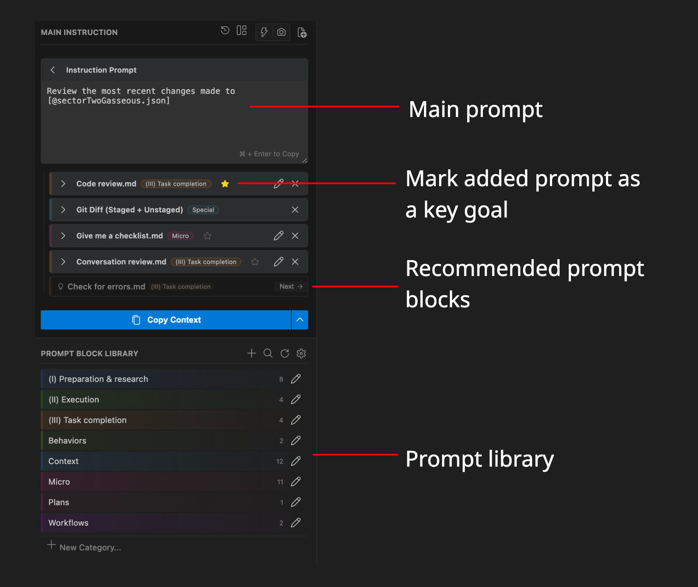
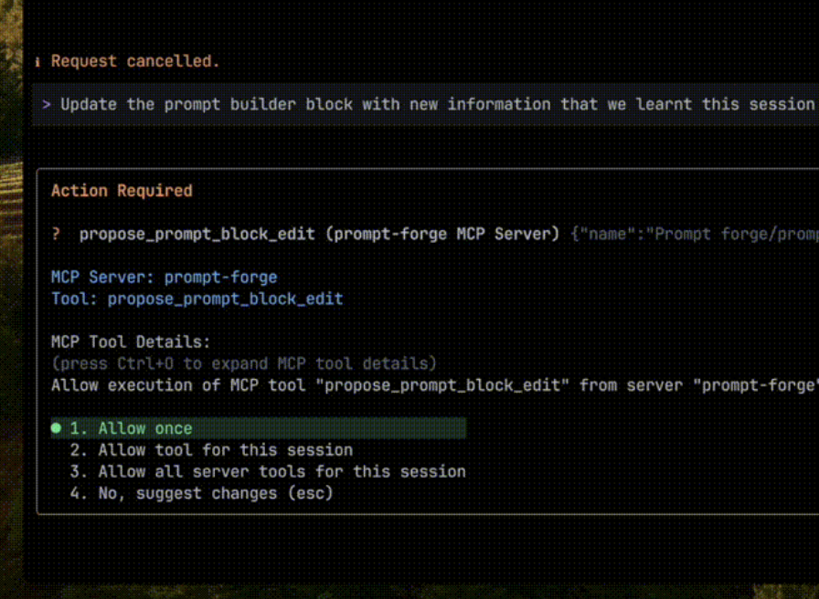
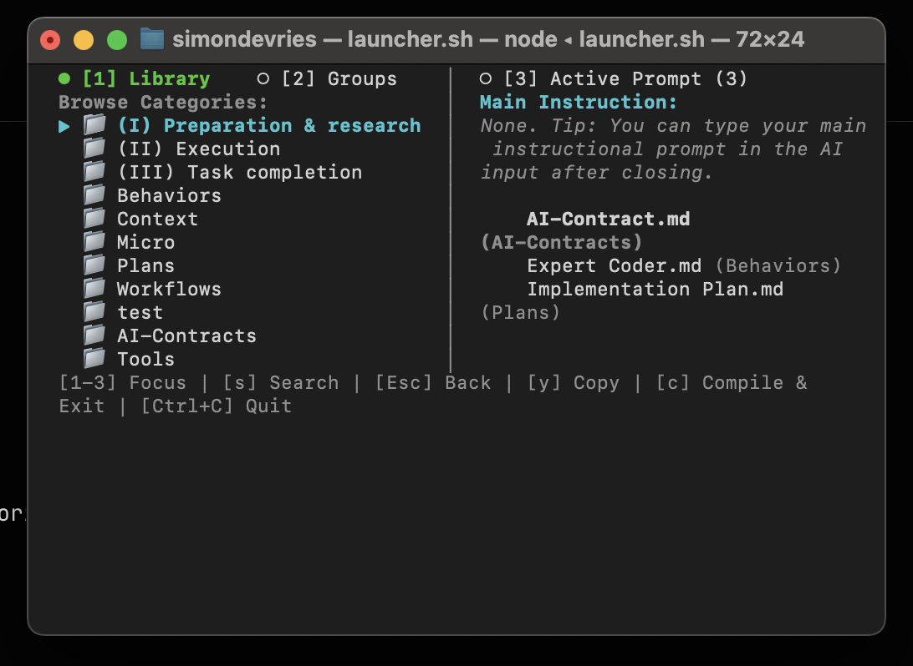
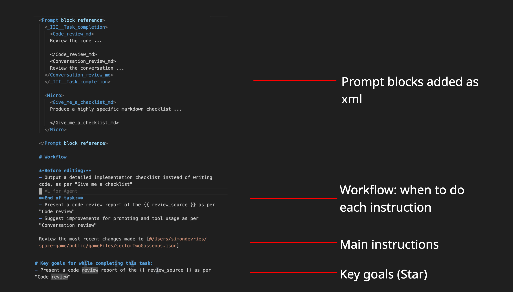
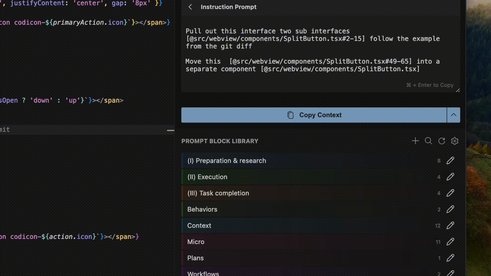
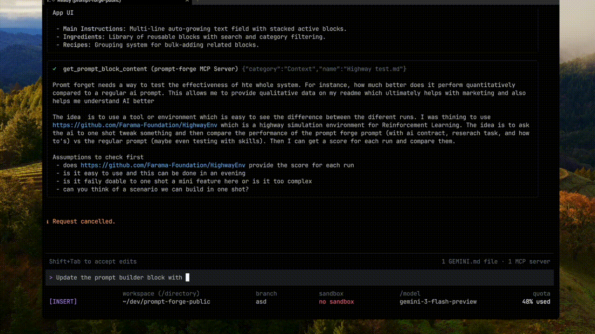

<div align="center">
  
  <h1>Prompt Foundry</h1>
  <br />
  
  
  
  
  <br />
  <a href="https://marketplace.visualstudio.com/items?itemName=sdevries.prompt-foundry">
    
  </a>
</div>

Jump to: [Demo](https://github.com/simondevries/prompt-foundry#demo) | [Setup instructions](https://github.com/simondevries/prompt-foundry#demo)

Prompt Foundry is a VS Code extension that makes AI more consistent and effective in large codebases, allowing you to get tasks done more effectively. Instead of rewriting context and task descriptions every session, you build a personal library of reusable prompt blocks\* — architecture notes, coding standards, behavioural contracts and expectations — and snap them together before each task. A bundled MCP server lets the AI write discoveries back into that library, so your prompts improve over time without manual upkeep.

\*A **prompt block** a markdown file that represents a prompt template in your library which is compiled with other blocks and your main instruction to form a complete prompt before sending to the AI.

| Problem                                                               | How Foundry handles it                                                                                                                                                                       |
| :-------------------------------------------------------------------- | :------------------------------------------------------------------------------------------------------------------------------------------------------------------------------------------- |
| Knowledge from AI sessions gets lost at the end of the session        | Maintain a personal library of context and architecture files (second brain). Create, update, append MCP tools: "please update xxx block with what we learnt"                                |
| Prompt library not accessible from Claude Code CLI                    | TUI to attach instructions to your prompt directly from the CLI tool                                                                                                                         |
| AI doesn't behave how I want it                                       | AI Contract defines role, style, and behavioural expectations upfront                                                                                                                        |
| Some instructions matter more than others                             | Star a prompt block to surface it as a key goal, or set a reference to position it at the right point in the workflow                                                                        |
| AI gets confused by conflicting information in `Agents.md` and skills | Task-specific prompt blocks keep global context lean and targeted                                                                                                                            |
| My MCP tool to my local file system is not powerful enough            | Use Liquid templating syntax to make prompt blocks more specific; use MCP tools to append to blocks (e.g. keep a log as the AI goes); review changes before committing to the prompt library |

### Overview of features

| VS Code extension                                                                             | MCP server (bundled, optional)                                | TUI (bundled, optional). Works directly from claude code                                                                          |
| :-------------------------------------------------------------------------------------------- | :------------------------------------------------------------ | :-------------------------------------------------------------------------------------------------------------------------------- |
|                      |       |                                                                           |
| Manage prompt library, compile prompts, `@` mentions and `add selection` from editor settings | Give AI access to your prompt block library to update content | Attach prompt blocks to your prompt from the command line. _E.g. in Claude Code you can press Ctrl+G to open the picker directly_ |

## Benchmark

The AI was asked to build a TUI version of Prompt Foundry (this is now a bundled feature!). Run #1 is a baseline prompt. Run #2 uses Prompt Foundry. Both use Gemini Flash Lite 3.1.

The key differences: better code structure and far less handholding.

| Run             | Achieved Task | Code Structure       | Handholding                 | Remaining Sig. Bugs |
| :-------------- | :------------ | :------------------- | :-------------------------- | :------------------ |
| **#1 Baseline** | Yes           | 1 large component    | Yes (had to re-align)       | Scrolling bug       |
| **#2 Foundry**  | Yes           | 3 components, 1 test | Minimal (errors/next steps) |                     |

Run #2 also followed instructions in the prompt blocks, generating code according to the defined style.

| Make a Plan              | Used Information        | TDD Approach | Code Comments | Added Logs |
| :----------------------- | :---------------------- | :----------- | :------------ | :--------- |
| ✓ including all sections | ✓ Used to stay on track | Attempted    | ✓ Some added  | ✓ Logs     |

Details: [Baseline](https://github.com/simondevries/prompt-foundry/commit/3126169a48daa651567340c4127fcb4afb0f14dc#diff-dedd314698bfcab1f61269c945458e105db17cbbf27163bf6e5bebdab2a99cad) | [Foundry run](https://github.com/simondevries/prompt-foundry/commit/ec1343262bf392c12db477a2a78f5d3a817bb735)

<details>
<summary>AI comparison of diffs</summary>

Both runs used `ink` (React-based TUI) and `clipboardy`. The architectural differences matter most if this TUI is to share a core backend with the VS Code extension, which is the intended direction.

**Baseline (#1)** added `commander` _and_ `meow` — two CLI argument parsers doing the same job. It also added `chalk` for terminal styling alongside `ink`, creating two competing approaches: ink's declarative React component model vs. imperative ANSI escape codes. This kind of mixed-paradigm dependency set creates friction as the codebase grows. It also included no test infrastructure.

**Run #2** dropped both redundant dependencies, kept styling within ink's component model, extended the component set with `ink-select-input`, and added `jest`, `ts-jest`, and `ink-testing-library`. The core business logic (`LibraryManager`, `SessionManager`, `PromptCompiler`) already has zero VS Code dependencies by design. Run #2's test setup means TUI components and core logic can both be unit-tested in isolation, without spinning up a VS Code instance or a live terminal.

In short: Run #1 works but accumulates debt. Run #2 reflects an understanding of where the project is heading.

</details>

## How it works

1. Type your prompt
2. Select your prompt blocks (instructions and information)
3. Mark the most important ones as goals
4. Copy/send to AI
5. Close the loop with MCP: At the end of a session, tell the AI to update your library — e.g. \*"update the auth-architecture block using the prompt foundry mcp with what we just decided." Next session, that knowledge is already there.

### The self-improving library

The MCP server exposes your prompt block library as readable and writable files. During a session the AI can:

- **Read** any block to get up-to-date context mid-task
- **Append** to a block — useful for keeping a running log of decisions
- **Overwrite** a block with revised content, which you review before committing

This means context compounds. Architectural decisions, gotchas, naming conventions — anything worth remembering gets written back in, in the right place, ready for the next session.

### Example output prompt structure:



[See demo](#demo)

## Setup

### Extension

Install the extension from the [VS Code Marketplace](https://marketplace.visualstudio.com/items?itemName=sdevries.prompt-foundry). This bundles with the MCP server and TUI. The extension includes a default block library to get you started. Blocks are read-only until you create your own prompt library directory — set the location via the gear icon next to prompt blocks or through VS Code settings.

> Note: When editing from the editor you need to open the prompt library folder in VS Code and click 'Trust'. The folder only contains `.md` files and prompt settings files.

### MCP server

> Note: The MCP server requires Node.js to be installed on your machine.

1. Open the extension
2. Click the gear next to `Prompt Block Library`
3. Click `Features & Permissions` > `MCP Server`
4. Copy the generated JSON snippet
5. Add it to your AI's MCP config

> Note: The MCP server runs locally as a Node.js process in the VS Code extension folder. The AI can read and modify the content of the specified prompt library folder via MCP tool calls.

### TUI

The TUI provides a way to quickly attach prompt blocks to a prompt in another app. For instance, in Claude Code you can press Ctrl+G to open an external editor, which can be configured to use this tool.

1. Open the extension
2. Click the gear next to `Prompt Block Library`
3. Click `TUI Dashboard`
4. Follow the instructions for Claude Code or to set the external editor

## Features

### Instructions prompt

Enter your main instructional prompt into the top instruction box.

The live focus (⚡) button lets you select files and lines in the IDE and adds those locations to the prompt. Useful for dictating while navigating a codebase — you end up with contextual file tags as you navigate, similar to someone watching your screen as you explain.

### Prompt blocks

A prompt block is a Markdown file containing reusable instructions or information. You have your own prompt library but can also attach a custom directory or workspace directory. Here is a simple example:

```markdown
# Code style

- Use TypeScript strict mode
- Prefer named exports over default exports
- Add JSDoc comments to all public functions
```

Blocks are organised into categories, one per folder, plus a set of special categories. Optionally add your Claude or Cursor skills too.

#### References

A block can include a short reference — a reminder compiled into a specific position in the prompt. This controls _where_ in the workflow the AI sees it, rather than dumping all instructions in one place.

`referenceLocation` controls where in the compiled prompt the reminder appears:

| Value                   | Position                     |
| :---------------------- | :--------------------------- |
| `workflowFirstTurn`     | Start of the first turn      |
| `workflowEveryChange`   | Before every code change     |
| `workflowBeforeEditing` | Before the AI starts editing |
| `workflowEndOfTask`     | End of the task              |
| `pre`                   | Top of the prompt            |
| `remark`                | General remark               |

#### Goals

Star a block to mark it as a goal. Its reference text gets pulled into a dedicated `# Key goals while completing this task:` section at the end of the prompt, giving the AI a clear summary of what matters most before it starts work.

#### Templating

Prompt blocks support Liquid syntax. Useful when you want to add custom variables to a block without rewriting it:

```liquid

vars:
  selectExample:
    type: select
    options: [
      "One",
      "Two",
    ]
  textExample:
   type: text

Select option: {{ selectExample }}

Text example: {{ textExample }}
```

#### Special categories

- **AI Contract (editable template):** Define role, comment style, and other behavioural expectations. The extension structures the prompt to encourage the AI to stick to the contract.
- **Tools:**
  - **Git commit:** Add a specific git commit.
  - **Git diff:** Add a diff against a branch or commit hash.
  - **IDE diagnostics:** Share detailed errors if you don't have IDE MCP set up.
  - **Active symbols:** Add file summaries for context.
- **Claude skills and commands:** Lists Claude skills and commands from your global Claude folder and prompts the AI to use them.
- **Cursor rules:** Same as above.

### Prompt block groups

When you frequently need to add the same prompt blocks, use the group feature. To create a group, add some blocks to the prompt and then press the '+' button next to group. The active prompts will be saved to the group.

## Demo

<div align="center">
  
  <br/>
  <em>Building a prompt with reusable blocks</em>
  <br/><br/>
  
  <br/>
  <em>Using MCP server to update blocks</em>
</div>

## License & Privacy

**License:** MIT © Simon de Vries

**Privacy:** 100% local. No telemetry, no data collection. Your prompts never leave your machine.

## Feedback

No telemetry means I rely on you. Suggestions and feature requests welcome:
https://form.typeform.com/to/hAc2CQ6A
