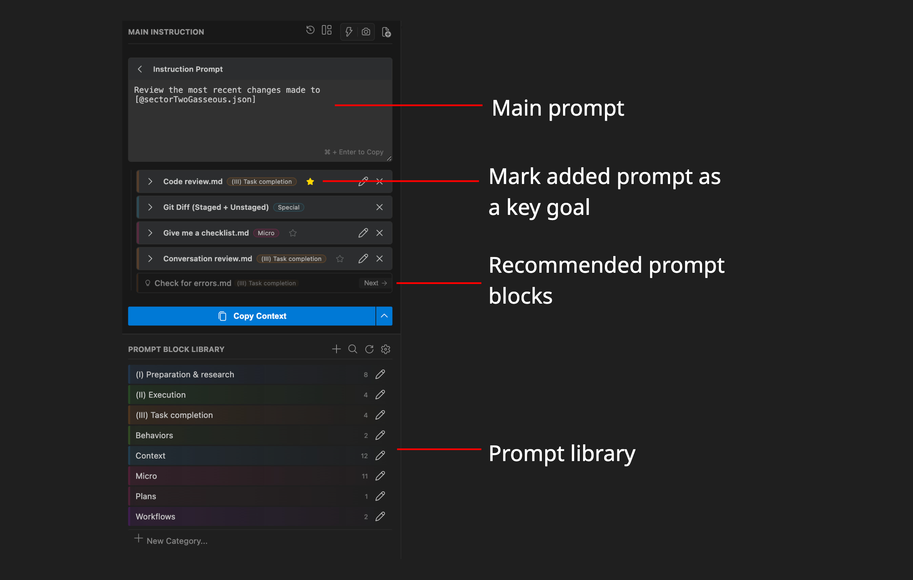

<div align="center">
  
  <h1>Prompt Foundry</h1>
  <br />
  
  
  
  
  <br />
  <a href="https://marketplace.visualstudio.com/items?itemName=sdevries.prompt-foundry">
    
  </a>
</div>

Rapidly compile more effective prompts and specs. Select from a library of prompt blocks ("how to", "information", "restrictions"), highlight the most important instructions, and provide guardrails for the AI. Build and manage your library of prompt blocks, keeping it up to date with the MCP self-learning loop.

## Benefits:
* **Provide task context, prescribe AI behaviour:** Provide the AI with a clearer set of instructions and expectations. Since you can quickly write a highly specific prompt, you can move information out of agents.md files and reduce this context bloat. Ultimately, this reduces the chances of conflicting information being passed into the AI. See benchmark results [here](https://github.com/simondevries/prompt-foundry#benchmark)

* **Build and evolve a knowledge library:** Use the local MCP server to let the AI update your prompt block library. A knowledge library that stays up to date allows you to have a central repository for your information.

* **Liquid syntax:** Use the templating engine to quickly customize the prompt blocks according to your current task.

* **Git & tools:** The record selection feature adds the current selection to the AI prompt (enables dictation while navigating).

## Overview:
1. Type your prompt
2. Select your prompt blocks (instructions and information)
3. Select your most important ones as goals
4. Copy/send to AI!
5. Use the MCP server for the AI to update any blocks at the end




## Demo

<div align="center">
  
  <br/>
  <em>Building a prompt with reusable blocks</em>
  <br/><br/>
  
  <br/>
  <em>Using MCP server to update blocks</em>
</div>

## Benchmark
*Run #1 Baseline test* 
Prompt on its own using Gemini Flash Lite 3.1. [details link](https://github.com/simondevries/prompt-foundry/commit/3126169a48daa651567340c4127fcb4afb0f14dc#diff-dedd314698bfcab1f61269c945458e105db17cbbf27163bf6e5bebdab2a99cad)

*Run #2*
Prompt compiled with Prompt Foundry using Gemini Flash Lite 3.1. [details link](https://github.com/simondevries/prompt-foundry/commit/ec1343262bf392c12db477a2a78f5d3a817bb735) 

| Run | Achieved Task | Code Structure | Handholding | Steering Prompts | Remaining Sig. Bugs | 
| :--- | :--- | :--- | :--- | :--- | :--- |
| **#1 Baseline** | Yes | 1 large component | Yes (had to re-align) | 6 | Scrolling bug |
| **#2 Foundry** | Yes |  3 components, 1 test | Minimal (errors/next steps) | 5 |  |

### Run 2 - Instruction Adherence
In addition to the results above, we see the AI in the Foundry run followed instructions in the prompt blocks. Generating code according to style.

| Make a Plan | Used Information | TDD Approach | Code Comments | Added Logs |
| :--- | :--- | :--- | :--- | :--- |
| ✓ including all sections | ✓ Used to stay on track | Attempted | ✓ Some added | ✓ Logs |

<details>
<summary>AI comparison of diffs</summary>

Both runs used `ink` (React-based TUI) and `clipboardy`. The architectural differences matter most if this TUI is to share a core backend with the VSCode extension — which is the intended direction.

**Baseline (#1)** added `commander` *and* `meow` — two CLI argument parsers doing the same job. It also added `chalk` for terminal styling alongside `ink`, creating two competing approaches: ink's declarative React component model vs. imperative ANSI escape codes. This kind of mixed-paradigm dependency set creates friction as the codebase grows, since contributors must decide which system to use for each new piece of UI. It also included no test infrastructure.

**Run #2** dropped both redundant dependencies, kept the styling within ink's component model, extended the component set with `ink-select-input` (enabling interactive list/menu navigation beyond plain text input), and — most significantly — added `jest`, `ts-jest`, and `ink-testing-library`. This matters for a shared-core architecture: the core business logic (`LibraryManager`, `SessionManager`, `PromptCompiler`) already has zero VSCode dependencies by design. Run #2's test setup means TUI components and core logic can both be unit-tested in isolation, without spinning up a VSCode instance or a live terminal. That's the right foundation for a codebase where the same core is consumed by two different surfaces.

In short: Run #1 works but accumulates debt. Run #2 reflects an understanding of where the project is heading.

</details>

## Setup

### Extension setup
Once you have installed the extension from the VS Code marketplace, you can immediately start building prompts. If you want to add or edit the prompt templates, you will need to allow the extension to create a prompt library somewhere on the file system. 

You can modify the location of this path through the settings gear next to the prompt blocks or via the VS Code settings panel.

> Note: In order to avoid a permissions error, when editing the extension from the editor you have to open that prompt library folder in VS Code and click 'trust'. You can manually check the folder's contents easily as it just contains .md files and the prompt settings files.

### MCP setup
To set up the MCP server, click on the settings gear in the app and click "Setup MCP server". This will provide you a JSON config you can paste into your AI's MCP settings. Note that the PROMPT_ROOT env setting should refer to the location of your prompt library folder.

Setup:
1. Open the extension
2. Click the gear next to `Prompt Block Library` 
3. Click `Setup MCP Server...` 
4. Copy the JSON snippet.
5. Add it to your AI's MCP config

> Note: The MCP server runs locally as a nodeJS process which is located in the VS Code extension folder. Please be aware that the AI is able to read and modify the content of the specified prompt library folder via MCP tool calls.

## Features

### Instructions prompt
Enter your main instructional prompt into the top instruction box. 

Pressing the live focus (⚡) button will allow you to select files and lines in the IDE and have the associated locations be added to the prompt. This is especially useful as you can dictate to the computer while navigating around the codebase, and you should end up with contextual file tags as you navigate - it creates a similar experience to someone watching your screen as you explain. 

### Prompt blocks
Prompt blocks are broken down into categories; one for each folder and also a set of special categories (bottom). 

#### References:
The generated prompt is broken into two sections: XML blocks of prompt blocks at the top, and Markdown for the main prompt at the bottom.

Prompt Foundry adds key reminders to the AI, in the bottom markdown section, to perform the task in the prompt blocks above. 

The text that gets added by the main block is determined by the following text in the prompt block.

```markdown
<!--
# reference: Ensure the code has been refactored by the end of the task
# referencelocation: workflowEndOfTask
-->
```
The `referenceLocation` determines where the goal is injected in the prompt (e.g., `workflowFirstTurn`, `workflowEveryChange`, `workflowBeforeEditing`, `workflowEndOfTask`, `pre`, or `remark`).


#### Goals
To highlight a task as being particularly important, Prompt Foundry adds the ability to mark blocks as a Goal.

Once added as a goal, the reference text gets added to a special section at the end of the prompt: # Key goals for while completing this task:

#### Liquid syntax:
Prompt templates support Liquid templating syntax. This is especially useful if you have a prompt for a specific purpose where you want to add some custom instructions. For example:
```liquid

vars:
  refactor_type:
    type: select
    options: [
      "One",
      "Two",
    ]
TODO
   role:  type: text

Refactor the code referenced in the main instruction prompt.
## Refactor Type: {{ refactor_type }}
```

#### Special categories:

* **Ai-Contract (editable template):** A special prompt block to try encourage the AI to behave a certain way. For instance defining the role, whether to create comments etc... The extension will generate a prompt in a way that encourages the AI to stick to the contract.
* **Tools:**
  * **Git commit:** Add a specific git commit.
  * **Git diff:** Add a diff against a branch or commit hash. 
  * **Ide diagnostics:** Share a detailed errors if you don't have IDE MCP setup.
  * **Active symbols:** Add file summaries for context.
* **Claude skills and commands:** Lists claude skills and commands from your global claude folder. This adds a prompt asking the AI to use those prompts.
* **Cursor rules:** Same as above.

### Prompt block groups
Create a block group once you've added a few blocks to the prompt. Those added blocks (but not the main instruction) get added under one group.
This is especially useful when adding the same blocks for certain tasks.

## License & Privacy

**License:** MIT © Simon de Vries

**Privacy:** This extension is **100% local**. It does not collect, store, or transmit any user data, telemetry, or prompt content. Your prompts and ingredients never leave your machine.

## Feedback
Since I am not collecting any telemetry, I really rely on your feedback! Please provide your suggestions, feedback, feature requests here:
https://form.typeform.com/to/hAc2CQ6A
